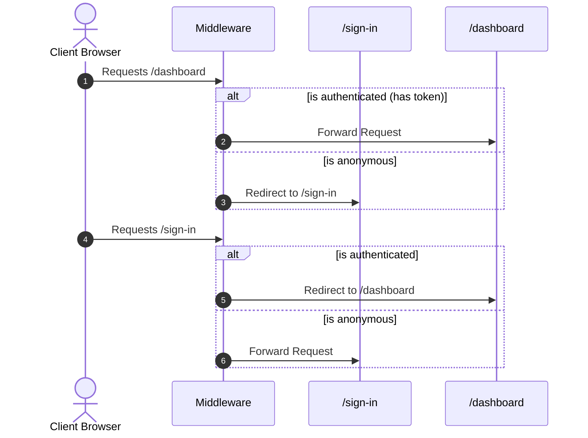

# Application Flow Document - PORTFOLIO-NEXT

This document outlines the routing, page hierarchies, and logic mapping of the application.

## Routing Map

The application utilizes Next.js App Router folders separated into specific route groups:

```
src/app/
├── (website)/               # Publicly viewable portfolio pages
│   ├── contact/             # Contact page containing validated email form
│   ├── resume/              # Timeline summary of skills & career history
│   ├── work/                # Filterable grid of active project representations
│   ├── layout.tsx           # Global website frame (Header, Navbar, Profile card)
│   └── page.tsx             # Root home screen ("About me" overview)
│
├── (auth)/                  # Session registration routes
│   ├── sign-in/             # Sign-in login panel
│   ├── sign-up/             # Create user account form
│   ├── verification-success/# Verified status dashboard routing landing page
│   └── layout.tsx           # Minimalistic authentication layout header frame
│
├── api/                     # Backend API endpoints
│   ├── auth/                # NextAuth session configuration directory
│   ├── user/                # User profile queries & endpoints
│   │   ├── sign-up/         # User creation mutation POST endpoint
│   │   └── validate/        # Token query validation GET checker
│   └── route.ts             # Health check HEAD test endpoint
│
├── provider.tsx             # Redux Store wrapper provider
├── sitemap.ts               # Canonical XML sitemap compiler script
└── robots.ts                # Search scraper crawler instructions index
```

---

## Access Controls & Middleware Flow

The application routing is protected by edge middleware (`src/middleware.ts`):



### Protected Routes List
- `/dashboard` (and any nested folders like `/dashboard/:path*`)
- `/admin` (and nested admin routes `/admin/:path*`)

---

## State Management Flow

Centralized state is coordinated using a Redux store combined with RTK Query api fetch endpoints:

```
[Store config: src/lib/store.ts]
               │
               ├─> reducer: { [userApi.reducerPath]: userApi.reducer }
               └─> middleware: userApi.middleware

[API Endpoints: src/services/userApi.tsx]
               │
               └─> mutation: signUp (POST -> /api/user/sign-up)
```

1. **Client interaction:** Submit sign-up request.
2. **RTK Trigger:** Mutation `useSignUpMutation` updates store cache, triggers POST request.
3. **API Handling:** `/api/user/sign-up` processes client input, updates MySQL through Prisma.
4. **Context Hydration:** Auth providers (`src/context/AuthProvider.tsx`) propagate global session changes downstream to nested client components.
