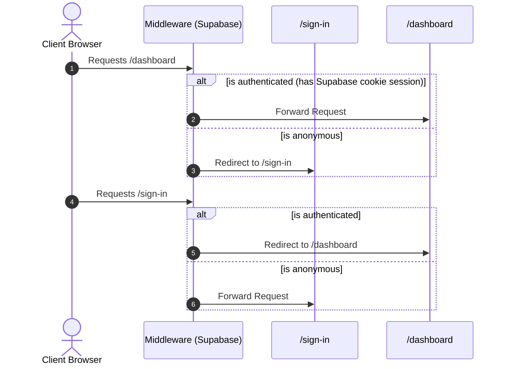
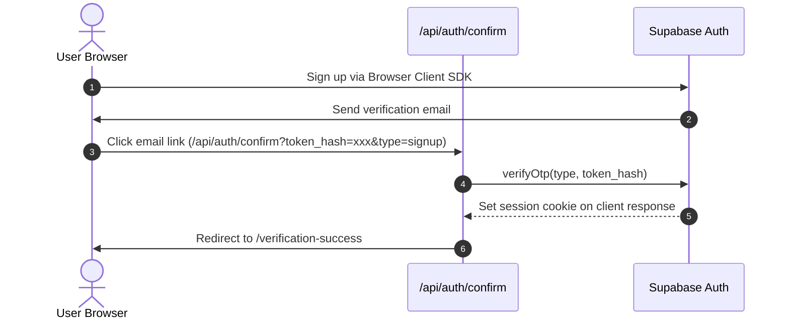

# Application Flow Document - PORTFOLIO-NEXT

This document outlines the routing, page hierarchies, and logic mapping of the application.

## Routing Map

The application utilizes Next.js App Router folders separated into specific route groups:

```
src/app/
├── (website)/               # Publicly viewable portfolio pages
│   ├── contact/             # Contact page containing validated email form
│   ├── resume/              # Timeline summary of skills & career history (Supabase-backed)
│   ├── work/                # Filterable grid of active project representations (Supabase-backed)
│   ├── layout.tsx           # Global website frame (Header, Navbar, Profile card)
│   └── page.tsx             # Root home screen ("About me" overview)
│
├── (auth)/                  # Session registration routes
│   ├── sign-in/             # Sign-in login panel (Supabase Client auth)
│   ├── sign-up/             # Create user account form (Supabase Client auth)
│   ├── verification-success/# Verified status landing page
│   └── layout.tsx           # Minimalistic authentication layout header frame
│
├── api/                     # Backend API endpoints
│   ├── auth/
│   │   └── confirm/         # Code-exchange OTP redirect handler
│   └── route.ts             # Health check HEAD test endpoint
│
├── provider.tsx             # Redux Store wrapper provider
├── sitemap.ts               # Canonical XML sitemap compiler script
└── robots.ts                # Search scraper crawler instructions index
```

---

## Access Controls & Middleware Flow

The application routing is protected by edge middleware (`src/middleware.ts`):



### Protected Routes List
- `/dashboard` (and any nested folders like `/dashboard/:path*`)
- `/admin` (and nested admin routes `/admin/:path*`)

---

## Session & Verification Flow (Supabase)



1. **Sign Up:** User enters details on `/sign-up`. Browser client calls `supabase.auth.signUp()`.
2. **Mail verification:** User receives signup link which directs them to `/api/auth/confirm?token_hash=...`.
3. **Session Exchange:** The GET handler in `confirm/route.ts` runs token verification and sets session cookies via `@supabase/ssr`.
4. **Final Page redirect:** User lands on `/verification-success`.
