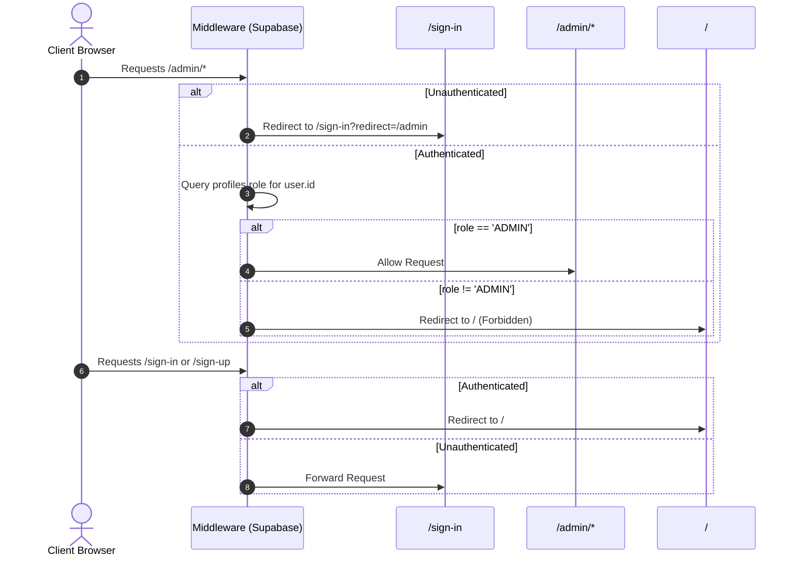
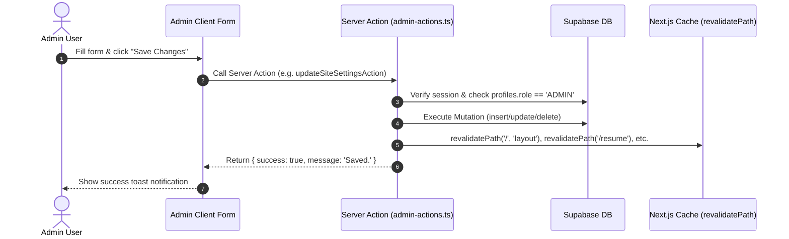

# Application Flow Document - PORTFOLIO-NEXT

This document outlines the routing structure, access middleware, and page hierarchies.

## Routing Map

The application utilizes Next.js 14 App Router organized into separated route groups:

```
src/app/
├── (website)/               # Publicly viewable portfolio pages (SSR / RSC)
│   ├── contact/             # Dynamic contacts + Formspree form
│   ├── resume/              # Dynamic education, work timeline & skills matrix
│   ├── work/                # Dynamic projects showcase cards
│   ├── layout.tsx           # Global website frame (Header, Navbar, Profile card)
│   └── page.tsx             # Root home screen ("About me" overview & about cards)
│
├── (admin)/                 # Administrative management control center (Protected)
│   ├── layout.tsx           # Admin shell (Navigation sidebar, header, role guard)
│   └── admin/
│       ├── page.tsx         # Dashboard overview with metrics & quick navigation
│       ├── site-settings/   # Edit global texts, owner info, resume PDF URL
│       ├── contacts/        # CRUD phone, email, and location entries
│       ├── social-links/    # CRUD LinkedIn, GitHub, Instagram links
│       ├── about-cards/     # CRUD "What I do!" homepage cards
│       ├── skills/          # CRUD skill categories & individual skills
│       ├── experiences/     # CRUD work & education timelines
│       └── projects/        # CRUD portfolio projects & tech chips
│
├── (auth)/                  # Session registration routes (Supabase Auth)
│   ├── sign-in/             # Sign-in login panel
│   ├── sign-up/             # Create user account form
│   ├── verification-success/# Verified status landing page
│   └── layout.tsx           # Minimalistic authentication layout frame
│
├── api/                     # Backend API endpoints
│   ├── auth/
│   │   └── confirm/         # Supabase OTP token verification callback
│   └── route.ts             # Health check HEAD test endpoint
│
├── provider.tsx             # Redux Store wrapper provider
├── sitemap.ts               # Canonical XML sitemap compiler script
└── robots.ts                # Search scraper crawler instructions index
```

---

## Access Controls & Role-Based Middleware Flow

The application routing is protected by edge middleware (`src/utils/supabase/middleware.ts`):



---

## Admin Mutation Flow (Server Actions)


