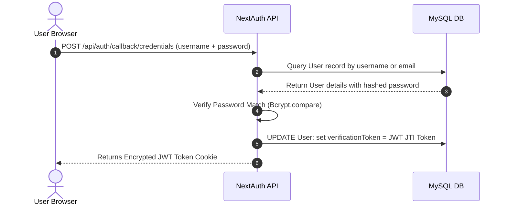

# Backend & Database Schema Document - PORTFOLIO-NEXT

## Database Engine Overview
The database backend currently runs on **MySQL** and is managed via **Prisma ORM**. The client configuration is located at `src/lib/prisma.ts`.

---

## Prisma Model Schema

The Prisma database schema contains a singular User model setup for authentication and admin dashboard settings:

```prisma
datasource db {
  provider = "mysql"
  url      = env("DATABASE_URL")
}

enum Role {
  USER
  ADMIN
  MODERATOR
}

enum UserStatus {
  ACTIVE
  INACTIVE
  SUSPENDED
}

model User {
  id                Int        @id @default(autoincrement())
  username          String     @unique
  password          String
  email             String     @unique
  firstName         String?
  lastName          String?
  bio               String?
  role              Role       @default(USER)
  status            UserStatus @default(ACTIVE)
  isVerified        Boolean    @default(false)
  verificationToken String?    @unique
  profilePicture    String?
  lastLogin         DateTime?
  deletedAt         DateTime?
  createdAt         DateTime   @default(now())
  updatedAt         DateTime   @updatedAt

  @@index([email])
  @@index([username])
}
```

---

## API Endpoints List

| Endpoint | Method | Input Parameters | Authentication | Purpose |
|:---|:---|:---|:---|:---|
| `/api/auth/[...nextauth]`| GET/POST| Credentials object | Public | NextAuth Credentials login wrapper callback |
| `/api/user/sign-up` | POST | Username, Email, Password, Name | Public | Registers a new user, hashes password, saves to DB |
| `/api/user/validate` | GET | `token` (Query Param) | Public | Verifies the registration token and activates user |
| `/api/` | HEAD | None | Public | Health check ping returning code 200 |

---

## NextAuth Authentication Loop



---

## Future Supabase Integration Roadmap
To support dynamic content loading without maintaining a self-managed server/database, the project is planned to transition to **Supabase** in the future:
1. **Database Migration:** Ports the current MySQL database structure (User status tables) directly to Supabase PostgreSQL schema.
2. **Dynamic Content Tables:** Create new Supabase tables to store resume education, projects experience, and contact forms history so they can be modified dynamically via a web console.
3. **Supabase Auth:** Replace Next-Auth custom credentials providers with Supabase client-side authentication configurations.
