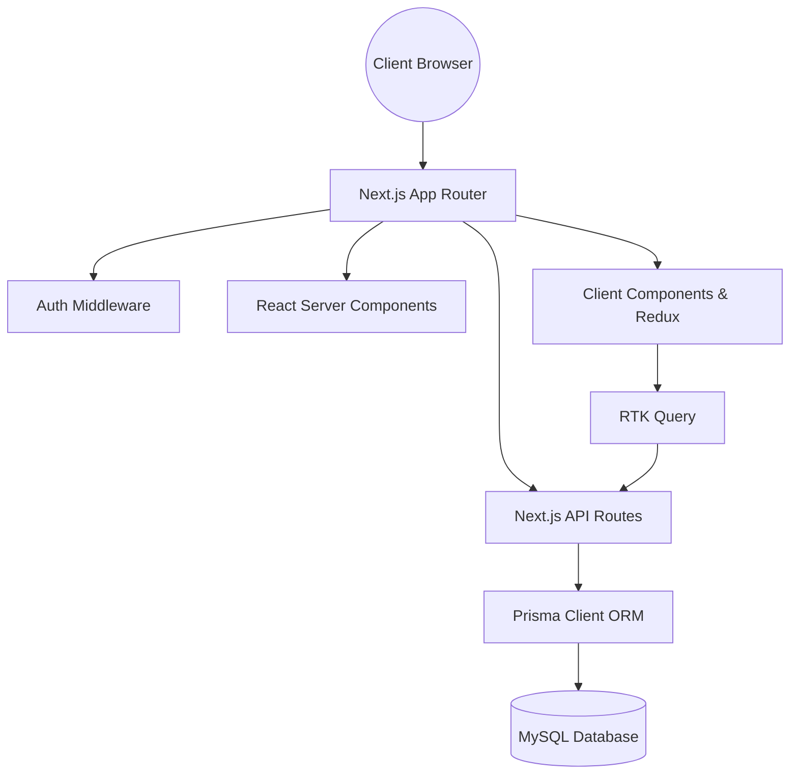

# Technical Requirements Document (TRD) - PORTFOLIO-NEXT

## Technical Architecture Overview
This application is constructed as a React application using the Next.js 14 App Router framework. It leverages Server Components (RSC) by default for optimal page indexing and bundle size, combined with hydrated Client Components for interactive UI fragments.

## Technology Stack

| Technology | Role | Version |
|:---|:---|:---|
| **Next.js** | Framework & App Router | `14.2.3` |
| **React** | Render Engine | `^18` |
| **TypeScript** | Type Safety | `^5` |
| **Tailwind CSS** | Styling System | `^3.4.1` |
| **shadcn/ui** | Component Library | New-York Style |
| **Framer Motion** | Micro-Animations | `^12.35.0` |
| **Redux Toolkit** | State & RTK Query | `^2.8.2` |
| **Prisma** | Database ORM | `^6.4.0` |
| **Next-Auth** | Authentication | `^4.24.11` |
| **Nodemailer** | Verification Mailer | `^6.10.0` |
| **Bcryptjs** | Password Hashing | `^3.0.2` |
| **Formspree React**| Contact Form Processing | `^3.0.0` |
| **Zod** | Validation Schemas | `^3.25.67` |

## Infrastructure & Environment Requirements
The project is optimized for deployment on the **Vercel Platform**. It requires the following environment variables:

- `DATABASE_URL`: Connection string for the MySQL database.
- `NEXT_PUBLIC_BASE_URL`: Root path of the application (e.g. for canonical links and auth callbacks).
- `NEXTAUTH_SECRET`: Hash seed for Next-Auth JWT encryption.
- `EMAIL_USER`: NodeMailer SMTP sender email.
- `EMAIL_PASS`: NodeMailer SMTP auth password.

## Security Controls
- **Authentication:** Credentials provider authentication using Next-Auth. Double hashing passwords via bcrypt salt rounds of 13.
- **Session Strategy:** Secure HTTP-only JSON Web Token (JWT) session storage.
- **Middleware Guard:** Path protection configurations matching dashboard routes and redirecting non-authenticated users.
- **Email Validation:** Account verification tokens created via unique JTI hooks.
