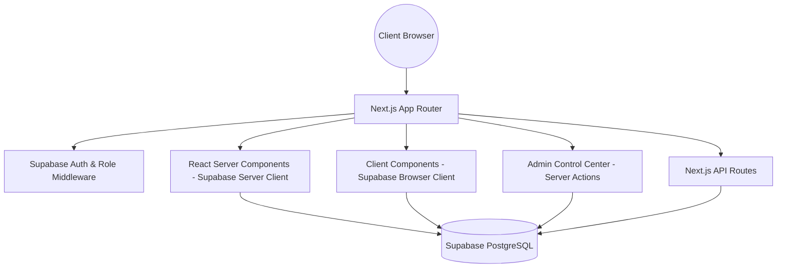

# Technical Requirements Document (TRD) - PORTFOLIO-NEXT

## Technical Architecture Overview
This application is constructed as a React application using the Next.js 14 App Router framework. It leverages Server Components (RSC) by default for optimal page indexing and bundle size, combined with hydrated Client Components for interactive UI fragments and an Administrative Control Center.

## Technology Stack

| Technology | Role | Version |
|:---|:---|:---|
| **Next.js** | Framework & App Router | `14.2.3` |
| **React** | Render Engine | `^18` |
| **TypeScript** | Type Safety | `^5` |
| **Tailwind CSS** | Styling System | `^3.4.1` |
| **shadcn/ui** | Component Library | New-York Style |
| **Framer Motion** | Micro-Animations | `^12.35.0` |
| **Redux Toolkit** | Client State & Store | `^2.8.2` |
| **Supabase Client**| Database & Auth Client | `^2.111.0` |
| **Supabase SSR** | Server-Side Auth Cookies | `^0.12.4` |
| **Formspree React**| Contact Form Processing | `^3.0.0` |
| **Zod** | Validation Schemas | `^3.25.67` |

## Infrastructure & Environment Requirements
The project is optimized for deployment on the **Vercel Platform** connected to **Supabase Database**. It requires the following environment variables:

- `NEXT_PUBLIC_SUPABASE_URL`: Root Endpoint of the Supabase project.
- `NEXT_PUBLIC_SUPABASE_ANON_KEY`: Public anonymous API key for client requests.
- `SUPABASE_SERVICE_ROLE_KEY`: (Optional) Service role key for administrative tasks.
- `NEXT_PUBLIC_BASE_URL`: Root path of the application (e.g. for canonical links and auth callbacks).
- `NEXT_PUBLIC_FORMSPREE_FORM_ID`: Formspree form ID for contact submissions.

## Security Controls
- **Authentication:** Managed by Supabase Auth with secure email verification callbacks.
- **Session Strategy:** Persistent cookie-based authentication handled via `@supabase/ssr`.
- **Role-Based Access Control (RBAC):** Access to `/admin/*` is restricted by middleware and Server Actions verifying `profiles.role = 'ADMIN'`.
- **Row Level Security (RLS):** Enabled on all 11 PostgreSQL tables (`profiles`, `site_settings`, `contacts`, `social_links`, `about_cards`, `skill_categories`, `skills`, `experiences`, `projects`, `blog_posts`, `stories`, `comments`).

- **Batch State Sync:** Dropping items automatically recalculates `sort_order` (1-based index) and calls dedicated Server Actions (`reorderExperiencesAction`, `reorderProjectsAction`, `reorderSkillCategoriesAction`, `reorderSkillsAction`, `reorderAboutCardsAction`, `reorderContactsAction`, `reorderSocialLinksAction`) with granular RBAC validation and automated ISR cache revalidation.

---

## 🔗 Related Specifications & Knowledge Nodes
- Central Hub: [[PORTFOLIO_GRAPH|Knowledge Hub (MOC)]]
- Product Requirements: [[docs/PRD|PRD]]
- Application Flow & Sequence: [[docs/APP_FLOW|App Flow]]
- Database Schema & Tables: [[docs/BACKEND_SCHEMA|Backend Schema]]
- System Patterns: [[memory-bank/systemPatterns|System Patterns]]
- Agent Governance: [[AGENTS|AGENTS.md]]

