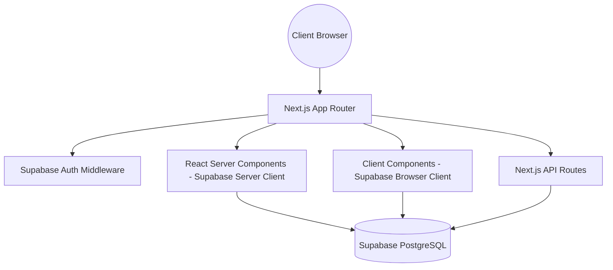

# Technical Requirements Document (TRD) - PORTFOLIO-NEXT

## Technical Architecture Overview
This application is constructed as a React application using the Next.js 14 App Router framework. It leverages Server Components (RSC) by default for optimal page indexing and bundle size, combined with hydrated Client Components for interactive UI fragments.

## Technology Stack

| Technology | Role | Version |
|:---|:---|:---|
| **Next.js** | Framework & App Router | `14.2.3` |
| **React** | Render Engine | `^18` |
| **TypeScript** | Type Safety | `^5` |
| **Tailwind CSS** | Styling System | `^3.4.1` |
| **shadcn/ui** | Component Library | New-York Style |
| **Framer Motion** | Micro-Animations | `^12.35.0` |
| **Redux Toolkit** | Client State & Store | `^2.8.2` |
| **Supabase Client**| Database & Auth Client | `^2.x` |
| **Supabase SSR** | Server-Side Auth Cookies | `^0.x` |
| **Formspree React**| Contact Form Processing | `^3.0.0` |
| **Zod** | Validation Schemas | `^3.25.67` |

## Infrastructure & Environment Requirements
The project is optimized for deployment on the **Vercel Platform**. It requires the following environment variables:

- `NEXT_PUBLIC_SUPABASE_URL`: Root Endpoint of the Supabase project.
- `NEXT_PUBLIC_SUPABASE_ANON_KEY`: Public anonymous api key for client requests.
- `NEXT_PUBLIC_BASE_URL`: Root path of the application (e.g. for canonical links and auth callbacks).

## Security Controls
- **Authentication:** Managed by Supabase Auth with secure OTP code confirmations.
- **Session Strategy:** Persistent cookie-based authentication handled via `@supabase/ssr` (syncs server actions, middleware, client router, and components).
- **Row Level Security (RLS):** Enabled on all public PostgreSQL tables (`profiles`, `projects`, `experiences`). Direct select queries are publicly open, while mutations (insert, update, delete) are locked to accounts with the `ADMIN` role.
- **Middleware Guard:** Intercepts requests to refresh expired session cookies and redirect unauthorized callers away from dashboard/admin routes.
